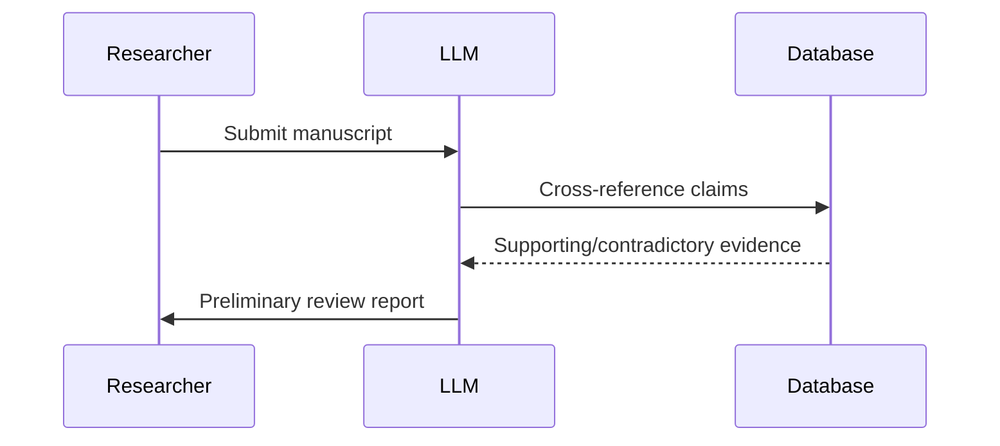

## The New Research Assistant
Large Language Models have evolved from simple text generators to sophisticated research partners capable of:
- Analyzing millions of research papers in seconds
- Identifying overlooked connections between disparate fields
- Generating literature reviews with proper citations
- Suggesting novel methodological approaches

> "Our lab's productivity increased 300% after implementing specialized LLM tools" - Dr. Elena Rodriguez, Computational Biology Lab Director

### Transformative Applications

| Discipline | LLM Application | Impact |
|------------|-----------------|--------|
| Medicine | Drug interaction prediction | High |
| Materials Science | Novel compound discovery | Medium |
| Social Sciences | Large-scale qualitative analysis | Revolutionary |

## The Peer Review Revolution
LLMs are addressing the peer review crisis through:
1. **Automated Plagiarism Detection**: Beyond simple text matching
2. **Methodological Validation**: Checking statistical soundness
3. **Bias Identification**: Flagging problematic language or assumptions
4. **Cross-disciplinary Insight**: Connecting relevant research from other fields

## Ethical Boundaries and Best Practices
The scientific community is establishing guidelines for responsible LLM use:
- **Transparency Mandate**: Disclosing LLM assistance in methods sections
- **Verification Protocols**: Human validation of all model outputs
- **Citation Integrity**: Ensuring proper attribution of AI-generated content
- **Bias Mitigation**: Regular auditing of training data and outputs

## Future Horizons
By 2028, we expect:
- **Specialized Research LLMs**: Trained on discipline-specific literature
- **Real-time Knowledge Synthesis**: Continuous updating of scientific consensus
- **Automated Meta-Analyses**: Instant systematic reviews of emerging topics
- **Hypothesis Generation Engines**: AI systems that propose testable theories

> The most impactful researchers of tomorrow will be those who effectively partner with AI while maintaining scientific rigor and ethical standards.

## Conclusion
Large Language Models are not replacing scientists—they're empowering them to achieve unprecedented scale and insight. The researchers who embrace these tools while upholding rigorous scientific standards will lead the next wave of discovery across all disciplines.
