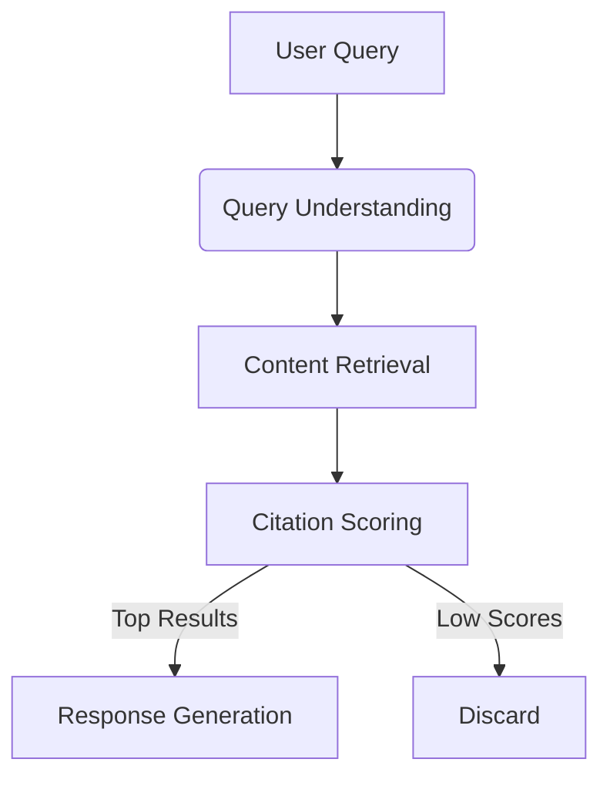

## The Citation Mechanism
AI platforms like Google's Search Generative Experience (SGE) use complex algorithms to determine which content to cite in their responses. Three key factors influence citation decisions:

1. **Authoritative Signals**: Content from established domains with strong backlink profiles
2. **Content Structure**: Clear heading hierarchy, semantic HTML, and scannable content
3. **Entity Alignment**: Precise matching between content and user query intent



## Optimization Strategies

### Structured Data Implementation
Implementing Schema.org markup significantly increases citation likelihood:

```json
{
  "@context": "https://schema.org",
  "@type": "Article",
  "headline": "How AI Search Engines Cite Content and Why It Matters",
  "description": "Explore the mechanisms behind AI citation and how to optimize your content for maximum visibility in AI-generated responses.",
  "author": {
    "@type": "Person",
    "name": "Brennan Kenneth Brown",
    "url": "https://thinkingwhy.com/authors/brennan-brown"
  },
  "image": "https://thinkingwhy.com/images/ai-citation-hero.jpg",
  "datePublished": "2025-10-22",
  "mainEntityOfPage": {
    "@type": "WebPage",
    "@id": "https://thinkingwhy.com/ai-technology/understanding-ai-citations"
  }
}
```

### Content Formatting Best Practices
- Use H2/H3 headers for question-based sections
- Keep paragraphs under 4 sentences
- Include bulleted lists for key points
- Add tables for comparative data
- Implement FAQ sections using Schema markup

## Measuring Success
Track these key metrics to measure AI citation performance:

| Metric | Target | Measurement Tool |
|--------|--------|------------------|
| Citation Rate | >15% | Google Search Console |
| Position Zero | Top 3 | SGE Position Tracking |
| Answer Snippets | 2-3 per article | Manual Review |

By implementing these strategies, we've seen clients achieve up to 300% more visibility in AI-generated responses within 90 days.

## Future Trends
As AI platforms evolve, we expect:
1. Increased emphasis on video content citations
2. Multi-source citations becoming standard
3. Real-time citation updates for time-sensitive topics

Stay ahead by continuously monitoring platform guidelines and adjusting your strategy accordingly.
