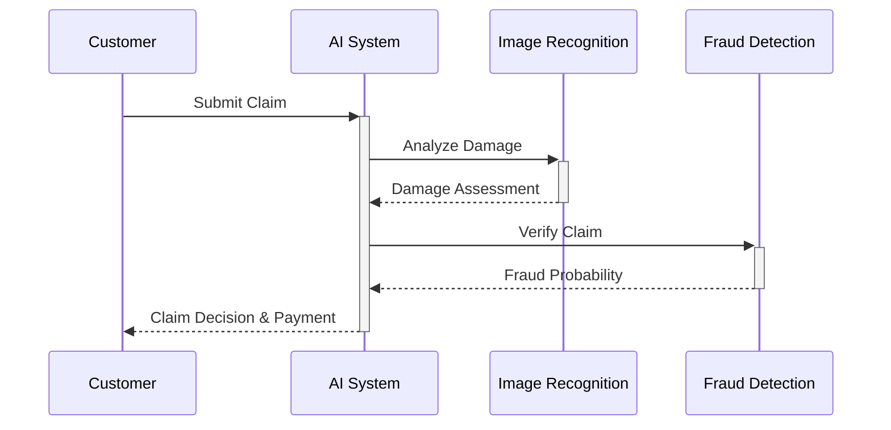

## Trend 1: Hyper-Personalized Premiums
AI now enables truly individualized pricing based on:
- Real-time driving behavior (telematics)
- Health monitoring wearables
- Home IoT sensor data

> "We've seen 30% more accurate risk assessment using AI models compared to traditional actuarial tables" - Industry Insider

## Trend 2: Automated Claims Processing
Leading insurers are achieving:
- 80% reduction in claims processing time
- 40% decrease in operational costs
- 95% customer satisfaction for simple claims

## Trend 3: Predictive Risk Modeling
Advanced ML models now incorporate:
1. Climate change impact projections
2. Regional economic stability indicators
3. Social media sentiment analysis

## Implementation Challenges
Despite the promise, insurers face hurdles:

| Challenge | Solution | Adoption Rate |
|-----------|----------|---------------|
| Data Silos | Unified data platforms | 45% |
| Regulatory Compliance | Explainable AI frameworks | 32% |
| Legacy Systems | Phased modernization | 28% |

## The Road Ahead
By 2027, we expect:
- 70% of claims to be fully automated
- AI-driven premiums to become industry standard
- New insurance products for digital assets and AI-related risks

Position your insurance business for the future by starting your AI transformation now.
