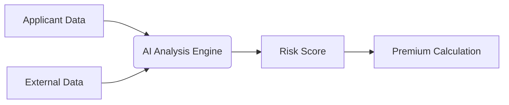

## The Algorithmic Revolution in Risk Assessment

> "We've reduced underwriting time from days to minutes while improving risk prediction accuracy by 40%" - Chief Innovation Officer, Global Insurer

Traditional underwriting methods are being rapidly displaced by AI-driven approaches that analyze thousands of data points in real-time. This shift represents both tremendous opportunity and significant ethical challenges.

### How AI Underwriting Works
Modern systems leverage:
1. **Predictive Analytics**: Machine learning models trained on historical claims data
2. **Alternative Data Sources**: Social media behavior, IoT device outputs, and purchasing patterns
3. **Real-time Processing**: Instant analysis of applicant information
4. **Continuous Learning**: Systems that improve with each new case

## The Ethical Minefield
Despite technological advances, three critical ethical challenges persist:

| Challenge | Industry Response | Effectiveness |
|-----------|-------------------|---------------|
| Algorithmic Bias | Diverse training datasets | Moderate |
| Explainability | "White-box" AI models | Low |
| Data Privacy | Anonymization techniques | High |

### Case Study: The Mortgage Discrimination Incident
In 2024, a major insurer faced regulatory action when their AI system was found to be:
- Penalizing applicants from certain ZIP codes
- Indirectly discriminating based on race
- Offering no transparent appeal process

This incident highlights the **critical importance** of human oversight in AI systems.

## The Path Forward
Responsible AI implementation requires:
1. **Regulatory Frameworks**: Developing industry-specific guidelines
2. **Human-in-the-Loop**: Maintaining underwriter oversight
3. **Audit Trails**: Comprehensive documentation of algorithmic decisions
4. **Consumer Education**: Transparent communication about data usage

> The most effective underwriting teams of 2026 will combine AI efficiency with human empathy and ethical reasoning.

## Conclusion
While AI promises unprecedented efficiency in insurance underwriting, the human element remains irreplaceable for ethical oversight and complex decision-making. The insurers who successfully navigate this balance will lead the industry's transformation.
