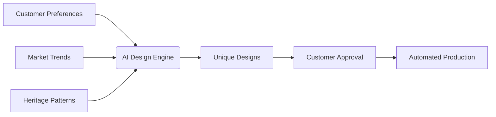

## The New Personal Shopper
AI concierges now offer:
- 24/7 personalized style advice
- Predictive trend forecasting
- Cross-brand wardrobe coordination

> "Our AI stylist knows your preferences better than your spouse after just three interactions" - Luxury Retail CEO

## Virtual Experiences
### Try-Before-You-Buy Revolution
Advanced technologies enabling:

| Technology | Application | Adoption Rate |
|------------|-------------|---------------|
| AR Mirroring | Virtual clothing fitting | 82% luxury brands |
| Haptic Feedback | Material texture simulation | 45% |
| Digital Twins | 3D product visualization | 67% |

## Bespoke Creation
AI is transforming custom design:
1. Generative design algorithms create unique patterns
2. Predictive analytics anticipate regional preferences
3. Automated manufacturing enables micro-batch production

## The Human-AI Balance
While AI enhances efficiency, luxury brands maintain:
- Human touchpoints for emotional connections
- Artisan collaboration for true craftsmanship
- Exclusive in-person events for VIPs

## Future Outlook
The next frontier includes:
- AI-curated luxury travel experiences
- Blockchain-authenticated AI-designed collectibles
- Emotion-responsive retail environments

Embrace these technologies to elevate your luxury brand above the competition.
